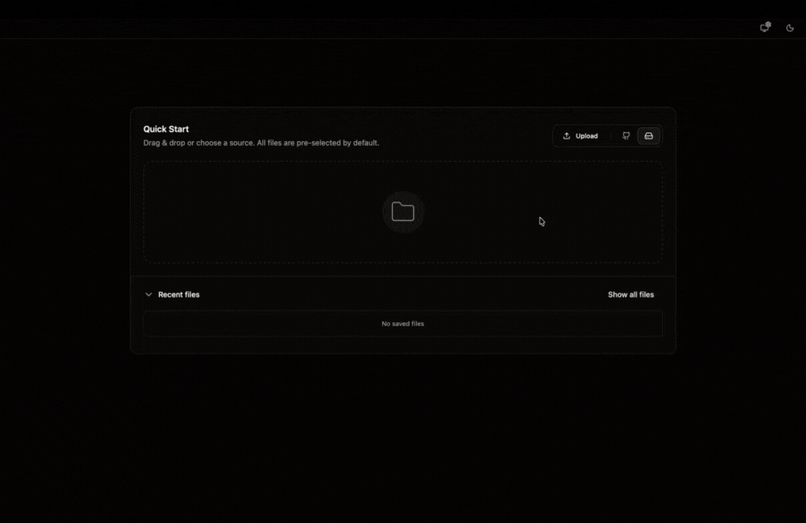
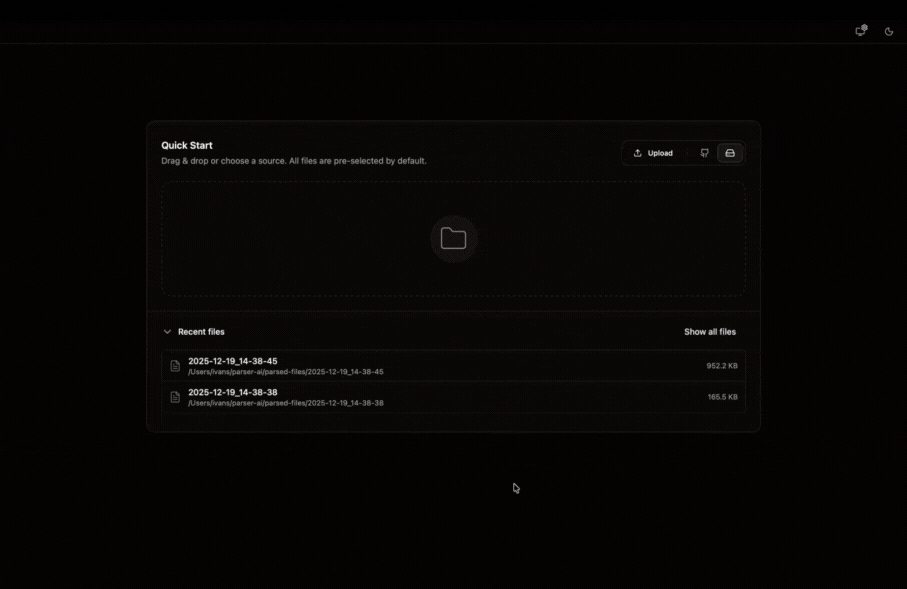

# Parser-codebase

**Desktop codebase parser & analyzer** built with **Tauri v2 (Rust)** and **SvelteKit (Svelte 5, TypeScript)**.

Parse local projects or Git repositories into a clean output content.txt , keep a history of runs, and quickly inspect results.

---

## Project team:

- [Ivan Semochkin (Developer)](https://github.com/baterson)
- [Fedor Semochkin (Developer)](https://github.com/Fedorse)

---

## Demo

<table>
  <tr>
    <td align="center">
      <b>Parsing local / remote repository</b> 
      
    </td>
    <td align="center">
      <b>Preview tree / navigation</b> 
      
    </td>
  </tr>
</table>

---

## Features

- Parse one or more folders/files into an aggregated text output (**content.txt**)
- Generate a navigable file-tree diagram for analyzing project
- Parse remote repo git
- Skip symlinks and attempt to parse **text files only** (binary files are ignored)
- Reveal results in app editor or OS file explorer

---

## Output & Storage

All parse results are stored locally under your home directory:

- **Parses directory:** `~/parser-codebase/<timestamp>/`

Each parse folder contains:

- `content.txt` — aggregated parsed content
- `metadata.json` — parse metadata (counts, sizes, timestamps, etc.)
- `tree.json` — file tree snapshot used by the UI

---

## Downloads (CI/CD Releases)

Installers are published via **CI/CD** as release artifacts.

1. Go to [Releases](https://github.com/Fedorse/Codebase-parser/releases/latest)
2. Download the latest build for your OS:
   - **Windows:** `.msi` or `.exe` (depending on your packaging)
   - **macOS:** `.dmg` / `.app` / `.zip` (depending on your packaging)
3. Install and run.

---

## Installation Notes (Unsigned / Gatekeeper / SmartScreen)

This is a **pre-release build** and may be **unsigned**

### macOS

If macOS blocks the app:

- Open **System Settings → Privacy & Security**
- Use **Open Anyway** (if shown), or
- Use terminal `xattr -cr /Applications/codebase-parser.app`

### Windows

If Windows SmartScreen shows a warning:

- Click **More info** → **Run anyway**

> Always download the app only from your official Releases page.

---
